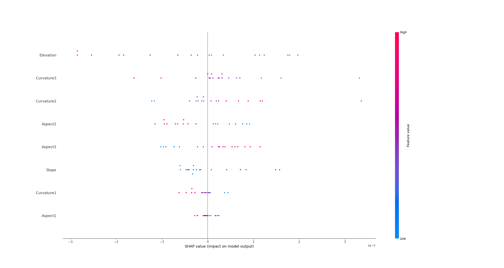

Explainable Artificial Intelligence approaches to understand and communicate spatial and temporal patterns of toxic chemicals, funded by NERC under NERC Discipline Hopping Fund.

There are 183 samples in total, but 4 were dropped due to outlier. 

