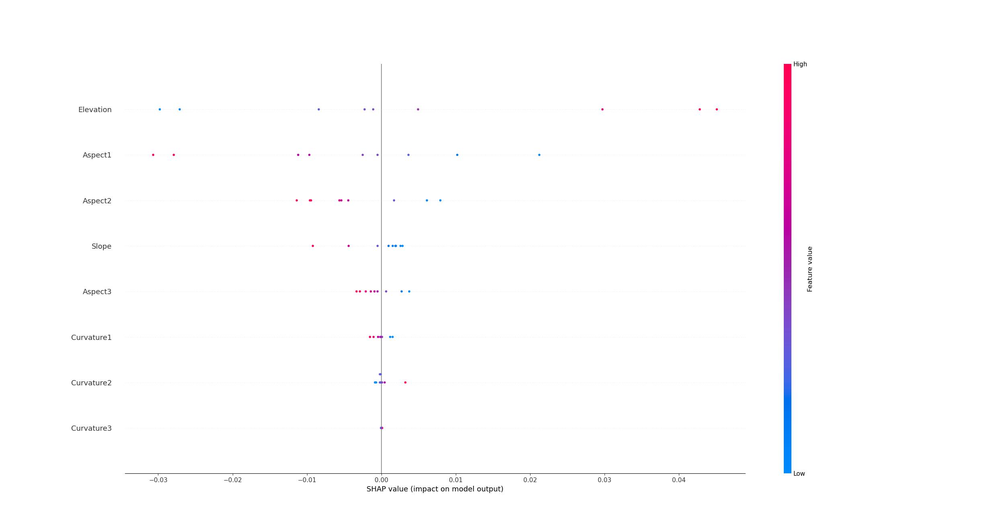
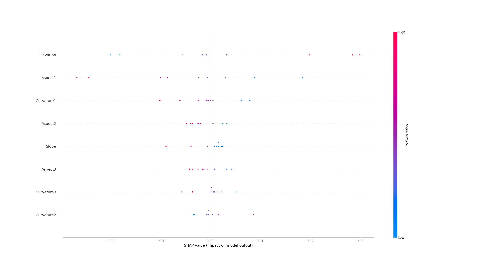

# Explainable Artificial Intelligence approaches to understand and communicate spatial and temporal patterns of toxic chemicals

There are 183 samples in total, but 4 outliers were dropped. Following the paper, we used sigmoid activation function, and the size of hidden layer is equal to the twice of the size of input feature.

This repo has three main parts: main.py, preproceesing.py, and model.py. But you only need to move to main function at first.  Then you can call extraction_data() function to clean and return dataframe type data. Then, you need to create NNs by instantiate Net() class. Finally, you just need to train the model, and explain your model.

## Experiment 1

After categorical data are transformed into one-hot encoding, the number of total available features is 87. However, compared with the data amount, the feature number may be too much. Therefore, we used first 8 features to conduct experiments with the purpose of explaining the neural network used to predicting DEHP. Meanwhile, we repeated 3 three times in order to reduce the impact of potential unstable factors.

RMSEs for 3 times repeated experiments: 0.188, 0.187, 0.208. The below three figures show that 'Elevation' feature made the most impact on predicting DEHP values. Meanwhile, the rank of impact for 'Slope' feature fluctuated during the repeated experiments, which may reflect the change on model performance. We boldly conjecture, the reason of the model in the third experiment did not perform better than the other two is that the model may not recognise or learn the 'Slope' feature well. (p.s. the conjecture is also applied for other features which have bigger changes on their ranks at the left side of figures.)  

We then tried to apply all features (87) to predict DEHP again.

RMSEs for 3 times repeated experiments: 0.192, 0.259, 0.299. Obvisouly,the performance decreased overall, insufficient training epochs assigned to NNs may results in lower performence. We used more features, and the number of trainable paramters also increased. The model with more parameters should take more training epochs to learn. However, 'Geology1' and 'RS4' are ranking at the first two position in three experiments.
|  | 
|:--:| 
| *Figure 4. DEHP with 87 features -1* |

|  | 
|:--:| 
| *Figure 5. DEHP with 87 features -2* |

|  | 
|:--:| 
| *Figure 6. DEHP with 87 features -3* |

RMSE: 0.179 for predicting PBDE 47
|  | 
|:--:| 
| *Figure 7. PBDE47* |

## Experiment 2

